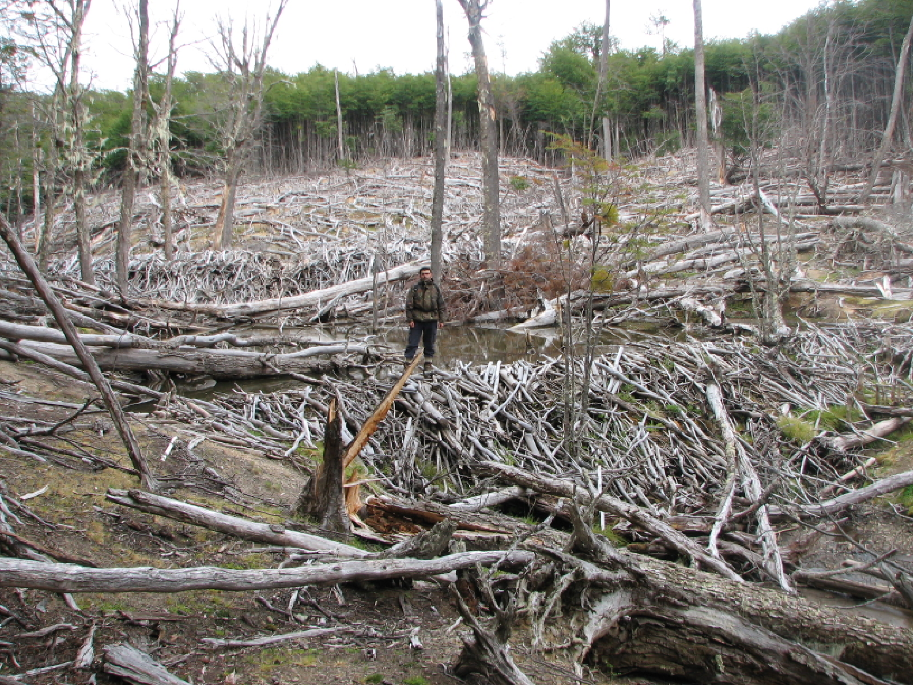

Invasive North American beavers in Southern Patagonia, Ecology, History and Folklore
========================================================
author: Derek Corcoran derek.corcoran.barrios@gmail.com
date: 2016-09-28
autosize: true
transition: rotate

Tierra del Fuego
========================================================
incremental: true

- Very uniform and cool weather
- Average high warm month 59 F
- Average low coldest month 30 F

***

Wind the prevailing force
========================================================

Wind the prevailing force
========================================================

Tierra del Fuego
========================================================
incremental: true

***

Tierra del Fuego
========================================================
incremental: true

Tierra del Fuego
========================================================

========================================================
incremental: true

========================================================
incremental: true

North American beaver (Castor canadensis)
========================================================

- Invasive species in Asia, Europe and South America
- Ecosystem engineer
- Reproduces once a year
- Monogamus, territorial and parental care of 3 years

***

History of beavers in Tierra del Fuego
========================================================

- 20 beavers were released in argentina Fagnano Lake (1946)
- Since then they have colonized the continent and archipielago
- More than 150,000 beavers in Patagonia 
- Human population in the region is 164,661

***

Effects of beavers in the environment
========================================================

Effects of beavers in the environment
========================================================

Effects of beavers in the environment
========================================================

========================================================

Fitness patterns
========================================================
incremental: true

Fitness patterns
========================================================
incremental: true

- Time consuming
- Hard to replicate
- Almost impossible in rare species
- Need to be able to detect the species
- Species might be there but not detected
- false absences might bias estimates

***

Fitness patterns
========================================================
incremental: true

- Time consuming
- Hard to replicate
- Almost impossible in rare species
- Need to be able to detect the species
- Species might be there but not detected
- false absences might bias estimates

***

Fitness patterns
========================================================
incremental: true

- Time consuming
- Hard to replicate
- Almost impossible in rare species
- Need to be able to detect the species
- Species might be there but not detected
- false absences might bias estimates

***

Beaver Folklore
========================================================
- Detection is usually not perfect
- Depends on:
  + Species
  + Season
  + Observer
  + Method
  + Weather
  
***

